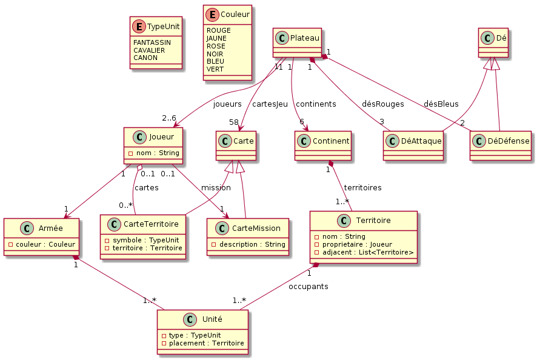

= Analyse du domaine
 
== Introduction

Pour notre projet, nous avons commencé par préparer les cas d’utilisations afin de décomposer le jeu pour avoir une meilleure vision de son fonctionnement.

On commence la partie avec 3 à 6 joueurs, il faut donc que les cartes du Risk soient distribuées en excluant les 2 Jokers à tous les joueurs puis on retourne les cartes à la pioche avec les Jokers. 
On distribue un nombre de Fantassins en fonction de nombre de joueurs (35-5 * (nombre_de_joueur-3)). Ensuite, On distribue une seule carte de mission par joueur.
Pour chaque tour un joueur dépose un Fantassin dans son propre territoire, en répétant cette étape jusqu’à la fin des cartes.

Apres la mise en place du jeu, les joueurs subissent à 3 phases : phase de renfort - phase d’attaque – phase de manœuvre ; qui seront décrites en détail dans les cas d’utilisation.
En ce qui concerne les cartes du Risk, le joueur doit faire une combinaison de cartes; soit 3 cartes de la même armé ou bien 3 cartes d’armés différentes; 
il les déposes pour gagner un nombre de Fantassins pour renforcer ses territoires.

Finalement, lorsque le joueur accomplit sa mission, la partie est finie.

== Cas d'utilisation

=== Mise en place d'un jeu

*Use Case :* Initialisation 3 joueurs ou plus  

*Id :* 	UC#1

*Description :* + 
Initialisation du jeu quand il y a entre 3 et 6 joueurs

*Pre-Conditions :* + 
il y a entre 3 et 6 joueurs, les joueurs sont près, il y a une pioche de 44 cartes risk et 14 cartes missions disponnible, il y a 5 dés disponnibles.

*Scénario nominal :*

. On retire de la pioche de 44 carte risk les 2 cartes joker +
. On distribue 1 carte risk a un joueur +
. On passe au joueur suivant + 
_les étapes 2 et 3 sont répétées tant qu'il reste des cartes risk._ +
[Start = 4]
. Les cartes risk sont retournées dans la pioche +
. Les joueurs pioches un certain nombre de fantassin +
. Un joueur dépose 1 fantassin sur chaque pays qu'il possède + 
_l'étape 6 est répété pour chaque joueur_ +
[Start = 7]
. Une carte mission est distribué a un joueur + 
_l'étape 7 est répété pour chaque joueur_ + 
[Start = 8]
. On tire au hasard le premier joueur +
. Le joueur pose un fantassin sur un territoire qu'il possède. +
. Passage au joueur suivant + 
_les étapes 9 et 10 sont répété tant qu'il reste un joueur avec des fantassins à poser_ +
[Start = 11]
. Le premier joueur commence UC#3 +

*Extension :*

[start = 5]
. Chaque joueur pioche (35-5 * (nombre_de_joueur-3))

[start = 7]
. Une mission portant sur la destruction de l'armée d'un joueur +
	.. Cette mission doit visé un joueur présent sur le plateau +
	.. Cette mission ne peut pas visé le joueur l'ayant reçu +

*Post-Conditions :*

Toutes les cartes territoires on été distribuée, Les joueurs ont posé tous leur fantassin de départ, Chaque joueur a une et une seul mission.

*Use Case :* Initialisation 2 joueurs

*Id :* 	UC#2

*Description :* + 
Initialisation du jeu quand il y a 2 joueurs uniquement

*Pre-Conditions :* +
il y a 2 joueurs, les joueurs sont près, il y a une pioche de 44 cartes risk et 14 cartes missions disponnible, il y a 5 dés disponnibles.

*Scénario nominal :*

. On retire de la pioche de 44 carte risk les 2 cartes joker +
. On ajoute un joueur neutre
. On distribue 14 carte risk au joueur neutre
. On distribue 1 carte risk a un joueur non neutre +
. On passe au joueur non neutre suivant + 
_les étapes 4 et 5 sont répétées tant qu'il reste des cartes risk._ +
[Start = 6]
. Les cartes risk sont retournées dans la pioche +
. Les joueurs non neutre pioches 40 fantassins +
. Le joueur neutre pioche 28 fantassins +
. Le joueur neutre dépose 2 fantassins sur chaque pays qu'il possède +
. Un joueur dépose 1 fantassin sur chaque pays qu'il possède + 
_l'étape 10 est répété pour chaque joueur_ +
[Start = 11]
. Une carte mission est distribué a un joueur non neutre + 
_l'étape 11 est répété pour chaque joueur non neutre_ + 
[Start = 12]
. On tire au hasard le premier joueur non neutre +
. Le joueur non neutre pose un fantassin sur un territoire qu'il possède. +
. Passage au joueur non neutre suivant + 
_les étapes 13 et 14 sont répété tant qu'il reste un joueur non neutre avec des fantassins à poser_ +
[Start = 15]
. Le premier joueur commence UC#3 +

*Extension :*

[start = 11]
. Une mission portant sur la destruction de l'armée d'un joueur +
	.. Cette mission doit visé un joueur présent sur le plateau +
	.. Cette mission ne peut pas visé le joueur l'ayant reçu +

*Post-Conditions :*

Toutes les cartes territoires on été distribuée, Les joueurs ont posé tous leur fantassin de départ, Chaque joueur non neutre a une et une seul mission

=== Déroulement

*Use Case:* Déroulement +
*Id :* UC#3 +
*Description :* +
Déroulement d'un tour de jeu pour un joueur +
*Pre-Conditions :* +
Initialisation est terminé, le joueur possède des territoire, il n'y a pas encore de gagnant +

*Scénario nominal :* 

. Le joueur fait la phase de renfort UC#4 
. Le joueur fait la phase d'attaque UC#5
. Le joueur fait la phase de manoeuvre UC#6 +
_les étapes 2 et 3 sont optionnelles_ +
[start = 4]
. Le joueur termine son tour
. Le joueur suivant commence UC#3

*Extension :*

. Si il y a uniquement 2 joueurs
.. Passage à UC#4bis

[start = 4]
. Si le joueur a rempli sa mission pendant son tour
.. Passage à UC#8

*Post-condition :* +
Le tour est terminé

*Use Case :* Phase de renfort +
*Id :* UC#4 +
*Description :* +
Phase de renfort pour le joueur +
*Pre-condition :* +
le joueur possède des territoires + 
*Scénario nominal :*

. Le joueur peut jouer une carte risk UC#7 +
_L'étape 1 est optionnelle_ +
[start = 2]
. Le joueur reçoit un nombre de fantassin correspondant à la division par 3 de la somme de ses territoires
. Le joueur reçoit des renfort bonus en fonction des continents qu'il contrôle complêtement
. Le joueur pose les fantassins où il le souhaite
. Le joueur reprend UC#3

*Extension :*

[start = 2]
. Le joueur reçoit au minimum 3 fantassins
.. La division est entière par défaut 
. Le joueur reçoit les bonus suivant en fonction des continent
.. +2 s'il contrôle l'Océanie
.. +2 s'il contrôle l'Amérique du sud
.. +3 s'il contrôle l'Afrique
.. +5 s'il contrôle l'Europe
.. +5 s'il contrôle l'Amérique du nord
.. +7 s'il contrôle l'Asie

*Post-condition :* +
le joueur a déposé tous ses renforts

*Use Case :* Phase de renfort à 2 joueurs +
*Id :* UC#4bis +
*Description :* +
Phase de renfort pour le joueur et le joueur neutre+
*Pre-condition :* +
le joueur possède des territoires + 
*Scénario nominal :*

. Le joueur peut jouer une carte risk UC#7 +
_L'étape 1 est optionnelle_ +
[start = 2]
. Le joueur reçoit un nombre de fantassin correspondant à la division par défaut de la somme de ses territoires
. Le joueur reçoit des renfort bonus en fonction des continents qu'il contrôle complêtement
. Le joueur neutre reçoit en renfort le nombre total de renfort reçut pas le joueur divisé par 2
. Le joueur pose les fantassins où il le souhaite sur ses territoires
. L'autre joueur pose les fantassins de l'armée neutre ou il le souhaite sur les territoires du joueur neutre
. Le joueur reprend UC#3

*Extension :*

[start = 2]
. Le joueur reçoit au minimum 3 fantassins
.. La division est entière par défaut
. Le joueur reçoit les bonus suivant en fonction des continent
.. +2 s'il contrôle l'Océanie
.. +2 s'il contrôle l'Amérique du sud
.. +3 s'il contrôle l'Afrique
.. +5 s'il contrôle l'Europe
.. +5 s'il contrôle l'Amérique du nord
.. +7 s'il contrôle l'Asie

*Post-condition :* +
le joueur a déposé tous ses renforts, l'autre joueur a dépose tous les renforts de l'armée neutre 

*Use Case :* Phase d'attaque +
*Id :* UC#5 +
*Description :* +
phase d'attaque pour du joueur +
*Pre-Condition :* +
le territoire attaqué est adjacent au territoire attaquant, le territoire attaquant a au moins 2 fantassins +
*Scénario nominal :*

. Le joueur attaquant désigne le territoire attaquant
. Le joueur attaquant annonce le territoire ciblé
. Le joueur attaquant déplace un certain nombre d'unité pour l'attaque
. Le joueur attaquant joue un dé par unité attaquante
. Le joueur défenseur joue un dé par unité défenseur
. Comparaison entre le dé le plus haut du joueur attaquant et le dé le plus haut du joueur défenseur
. Les deux dés comparés sont retirés +
_les étapes 6 et 7 sont répétées tant qu'il reste des dés de défense_ +
_les étapes 1 à 7 sont répétées tant que le joueur souhaite attaqué_ +
[start = 8]
. le joueur reprend UC#3

*Extension :*

[start = 3]
. Le nombre de fantassin déplacé pour l'attaque ne doit pas rendre le territoire attaquant vide
.. Le joueur attaquant peut engager jusqu'a 3 fantassins
. Le chiffre tiré doit être entre 1 et 6
. Le joueur défenseur peut engager jusqu'a 2 fantassins +

[start = 5]
. Le chiffre tiré doit être entre 1 et 6 +
. Si le chiffre du joueur attaquant est strictement supérieur au chiffre du défenseur
.. Le joueur attaquant gagne
.. Le joueur attaquant supprime un fantassin sur le territoire ciblé du joueur défenseur
.. Si le territoire ciblé est vide le joueur attaquant déplace toute les unité engagé sur le territoire ciblé

[start = 6]
. Si le chiffre du joueur défenseur est supérieur ou égal au chiffre du défenseur
.. Le joueur défenseur gagne
.. Le joueur défenseur supprime un fantassin sur le territoire attaquant du joueur attaquant

[start = 8]
. Si le joueur a conquit un territoire
.. Il peut piocher une carte
... Si il n'a pas déjà piocher une carte dans le tour
... Si il n'a pas 5 cartes dans sa main

*Post-condition :* +
Le joueur a fini sa phase d'attaque

*Use Case :* Phase de manoeuvre +
*Id :* UC#6 +
*Pre-condition :* +
Le territoire de départ et le territoire d'arrivé sont adjacents, le territoire de départ et le territoire d'arrivé sont possédé par le joueur

*Scénario nominal :* 

. Le joueur retire les fantsins du territoire de départ
. Le joueur pose les fantassins sur le territoire d'arrivé +
_Les étapes 1 et 2 peuvent être répétées_ +

[start = 3]
. Le joueur reprend UC#3

*Extension :*

. Sur les fantassins retirés du territoire
.. Le nombre de fantassin déplacer ne doit pas rendre le territoire vide
.. Les fantassins ne peuvent dépacler qu'une seule fois par tour
.. Les fantassins utilisés lors d'une attaque peuvent être déplacé

*Post-condition :* +
Les fantassins ont bien été dépalcer de leur territoire de départ vers leur territoire d'arrivé

*Use Case :* Joue une carte risk +
*Id :* UC#7 +
*Pre-condition :* +
Le joueur a au moins 3 cartes risk dans sa main

*Scénario nominal :* 

. Le joueur dépose 3 carte risk de sa main
. Le joueur reçoit un nombre d'unité renfort

*Extension :*

. Les cartes doivent faire une des combinaisons suivante :
.. Fantassin - Fantassin - Fantassin
.. Fanassin - Cavalier - Canon
.. Cavalier - Cavalier - Cavalier
.. Canon - Canon - Canon

[start = 1]
. Les cartes joker peuvent remplacer n'imorte quel symbole
. Le nombre de renfort dépend de la combinaire obtenu :
.. Fantassin - Fantassin - Fantassin : + 4 renforts
.. Fanassin - Cavalier - Canon : + 10 renforts 
.. Cavalier - Cavalier - Cavalier : + 6 renforts
.. Canon - Canon - Canon + 8 : renforts

[start = 2]
.  Pour chaque carte utilisé, si le territoire présent dessus est possédé par le joueur l’utilisant, il y place 2 renforts

*Post-condition :* +
Le joueur a reçu des renforts en fonction des combinaisons obtenues, Le joueur a placé les renforts en fonction des cartes jouées

=== Fin du jeu

*Use Case :* Fin de partie +
*Id :* UC#8 +
*Pre-condition :* +
Un joueur a accompli sa mission

*Scénario nominal :*

. Le joueur remorte la partie
. Fin du jeu

*Post-condition :* +
La partie est finie

== Modèle de classes du domaine

== Dictionnaire de données
	
include::terms.adoc[]

== Conclusion

Dans cette première partie, on a réalisé une conception des problèmes qu'on sera ramené à résoudre. Ils nous semblent ainsi plus claires grâce au différents cas d'utilisation et au diagramme de classe qui connaitrera une éventuelle évolution toute au long des étapes d'analyse, conception et réalisation de ce projet.
Cette étape va nous permettre aussi une meilleure anticipation de quelques futures extensions.

