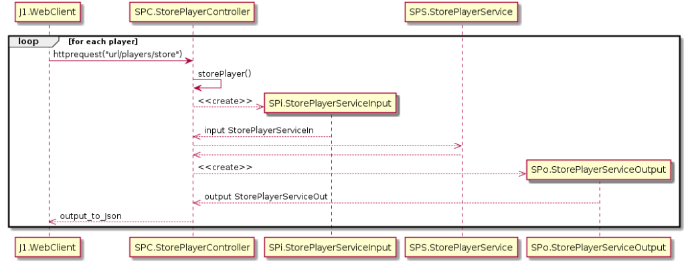

= Conception détaillée
. La communication entre le WebServer et le WebClient se fait à la classe injectable 'game_player.service.ts' qui
. permet au WebClient de faire appel au Rest Web services du WebServer, par une requete HTTP.
. Le WebServer reçoit la requete et fait appel à son service dédiée pour la traiter :les classes du package 'CONTROLLER',
. stocke les nouvelles informations dans la base de données en faisant appel aux servicex:les classe du package 'SERVICE'
. et renvoie la reponse sérialisée en format JSON au coté client.

. Les deux composant suivants

== Le composant WebServer

== Le composant WebClient

Communiquent de la manière suivante

Les POINTS FORTS de notre jeu contistent en une rapide responsivité au actions du joueurs grace performance offerte par le framework Angular 
par une singleWebPage.
De plus les fonctionnalités envisagées lors de notre Analyse du domaine sont toutes fonctionnelles.

Parmi les POINTS FAIBLES de notre jeu, on peut considérer que le manque du plugin Uglify ou plus de vérifications du coté Serveur aurait assuré au mieux 
la sécurité de notre application.