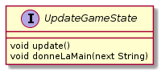
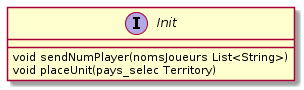
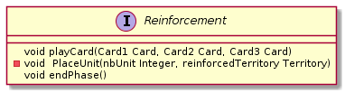
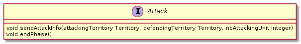
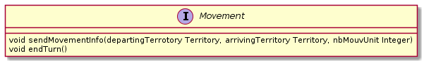
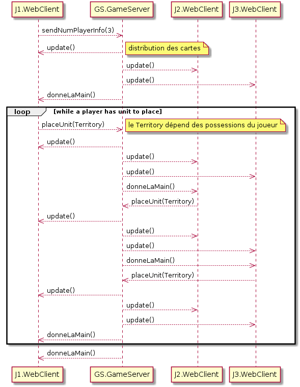
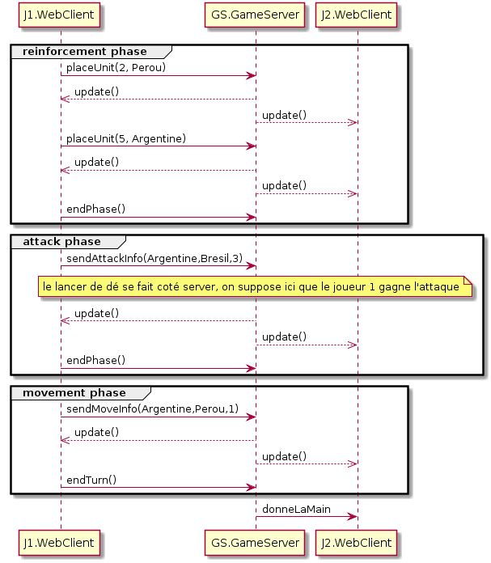

= Spécification des composants

Ce livrable correspond à la "conception préliminaire" du projet. Il comprend la division de la solution en différents composants, l'explication des fonctionnalités attendues de chaque composant, la spécification des interfaces fournies par chaque composant, ainsi que des diagramme de séquence qui valident ces interfaces.

== Objectif
Dans ce chapitre nous allons détailler les différents comosants notre projet, ainsi que les intéraction attendu entre ces composants.

== Organisation du chapitre

On commencera par décrire les composants du projet, nous préciserons ensuite les interfaces de ces composants. Enfin nous verrons les interactions entre les composants dans plusieurs cas différents. 

== Description des composants 

Nous avons deux composants : `Game Server` et `Web Client`. On souhaiterai que le composant `Web Client` puissent uniquement envoyé au serveur les actions qu'il souhaite effectuer, ainsi le composant `Game Server` effectue le calcul des actions effectué par le client. 

== Le composant `Game Server`

Le server doit pouvoir rafraichir les informations sur le jeu en fonction des actions du joueurs. Quand un joueur termine son tour, le serveur doit donner la main au joueur suivant. On a donc une seul interface qui gère l'état du jeu. 

=== Spécification de l'interface

==== Spécification de l'interface UpdateGameState
	 

*void* *update()* : rafraichi l'état du jeu. Calcul le nombre de renfort d'un joueur, calcul le résultat d'une attaque, rafraichi l'affichage de la carte, distribue les cartes, etc... +
*void* *donneLaMain(next String)* : donne la main au joueur suivant, est utilisé uniquement lorsque le joueur courant a effectué l'opération `endTurn()`

== Le composant `Web Client`

Le client doit pouvoir géré l'initialisation d'une partie, ainsi que ses 3 phases de jeu (attaque, renfort, mouvement) on a ainsi interfaces pour le Web Client nommé "Init", "Attack", "Movement" et "Reinforcement"

=== Spécification des interfaces
==== Spécification de l'interface Init

*void* *sendNumPlayer(nombre_joueur : Integer)* : cette opération sert à l'initialisation, elle envoie au serveur une liste des noms des participants. En fonction de cette liste le serveur peut en déduire le nombre de joueur. +
*void* *placeUnit(pays_selec : Territory)* : cette opération sert au joueur à placer une unité sur un territoire donné.

==== Spécification de l'interface Reinforcement

*void* *playCard(card1 : Card, card2 : Card, card3 : Card )* : cette opération permet au joueur de joué 3 cartes. +
*void* *placeUnit(nbUnit : Integer, reinforcedTerritory : Territory)* : cette opération permet au joueur de placer un certain nombre d'unité sur un territoire donné 
*void* *endPhase()* : cette opération sert au joueur à terminer sa phase de renfort.

==== Spécification de l'interface Attack

*void* *sendAttackInfo(attackingTerritory : Territory, defendingTerritory : Territory, nbAttackingUnit : Interger)* : cette opération sert à envoyé au serveur les informations sur l'attaque effectué par le joueur. +
*void* *endPhase()* : cette opération sert au joueur à terminer sa phase d'attaque.

==== Spécification de l'interface de Mouvement

*void* *sendMovementInfo(departingTerritory : Territory, arrivingTerritory : Territory, nbMouvUnit : Integer)* : cete opération sert à envoyé au serveur les informations sur le mouvement de troupe effectué par le joueur. +
*void* *endTurn()* : La phase de mouvement étant la dernière phase de jeu le joueur termine son tour avec cette opération.

== Interactions

=== Mise en place d'un jeu

==== Interaction: cas nominal (ici 3 joueurs mais reste identique quelque soit le nombre de joueur)

=== Tour d'un joueur 
Les intéractions se font avec deux joueurs, mais elles ne changeraient pas si il y avait plus de joueurs

==== Interaction: cas nominal
Etat du jeu : Le joueur 1 a 7 unitées à placer et il possède l'Argentine et le Perrou, il a pour mission de détruire les armées du joueurs 2. Le joueurs 2 possède tous les autres pays, il a pour missions de détruire les armées du joueurs 1.

